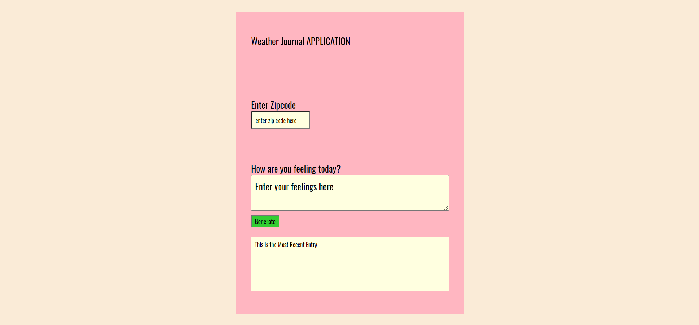

# weather jounral app
Weather journal app, gets temperature about a city given its zip code from the API of [open weather map](https://openweathermap.org/) then displays it. 

### Made with:
	- Node.js
	- Express.js
	- HTML
	- CSS
	- JavaScript

## UI

